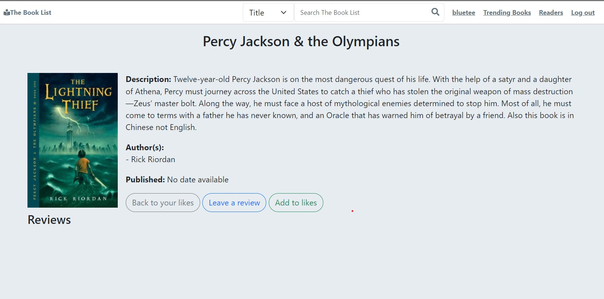

<a name="readme-top"></a>

<!-- PROJECT LOGO -->
<br />
<div align="center">
  <h3 align="center">The Book List</h3>

  <p align="center">
    A place to find books and reviews.
  </p>
</div>

<!-- ABOUT THE PROJECT -->
## About The Project


The Book List uses The Open Libraries API to allow a users to find trending books, search their vast library and leave reviews.

Features:
* See currently trending books
* Find out what other readers are reading
* Save books to to your list
* Leave and read book reviews

### Built With

* Python3
* Flask
* PostgreSQL
* Bootstrap

<p align="right">(<a href="#readme-top">back to top</a>)</p>

<!-- GETTING STARTED -->
## Getting Started
1. Have PostgreSQL 
2. Create databases the-book-list
3. For testing create database the-book-list-test
4. Download the code
   ```sh
   git@github.com:blueteeanderson/the-book-club.git
   ```
5. Go to root director
6. Create a virtual environment: python3 -m venv venv
7. Activate: source venv/bin/activate
8. Install requirements: pip install -r requirements.txt
9. Run server: flask run
 
<p align="right">(<a href="#readme-top">back to top</a>)</p>

<!-- ROADMAP -->
## Roadmap

- [x] Trending books
- [x] Book search
- [x] Readers list
- [ ] Users list
    - [x] List bokks
    - [x] Like books
    - [ ] Remove books 
- [x] Review
- [x] Likes
- [ ] Checkout books from Open Library
- [ ] Social
    - [ ] Follow readers
    - [ ] Comments to followed readers
    - [ ] Book suggestions

<p align="right">(<a href="#readme-top">back to top</a>)</p>


<!-- LICENSE -->
## License

Note: Book images may be copyrighted.

Distributed under the MIT License. See `LICENSE.txt` for more information.

<p align="right">(<a href="#readme-top">back to top</a>)</p>


<!-- CONTACT -->
## Contact

 [Tee Anderson ](mailto:teeanderson2919@gmail.com) - teeanderson2919@gmail.com

Project Link: [https://github.com/blueteeanderson/the-book-club](https://github.com/blueteeanderson/the-book-club)

<p align="right">(<a href="#readme-top">back to top</a>)</p>


<!-- ACKNOWLEDGMENTS -->
## Acknowledgments

* [Open Library](https://openlibrary.org/)
* [Bootstrap Iconse](https://icons.getbootstrap.com/)
* [React Bootstrap Docs](https://react-bootstrap.netlify.app/)

<p align="right">(<a href="#readme-top">back to top</a>)</p>
